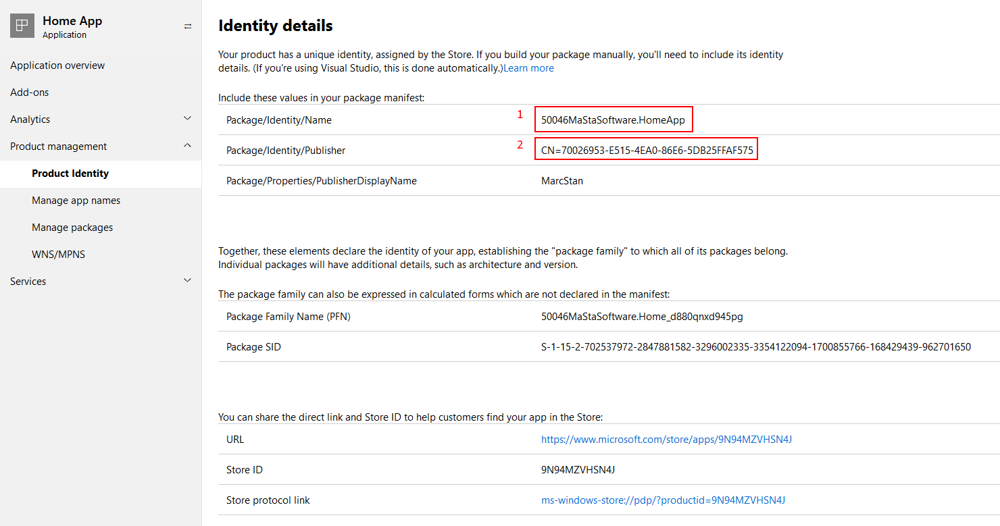
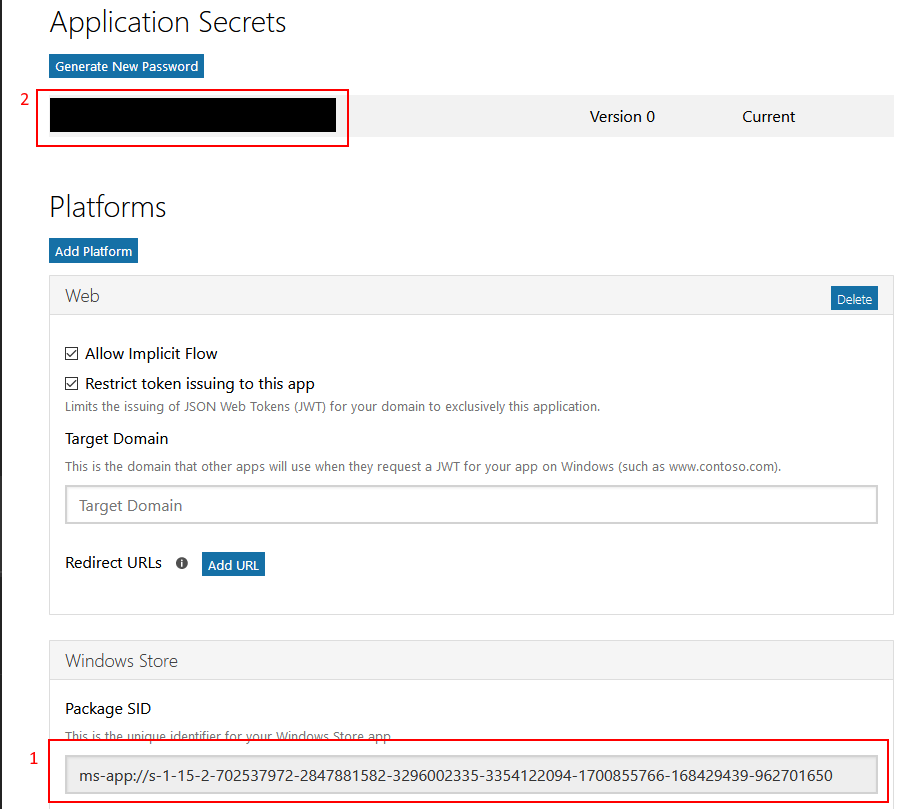

Originally published on my [blog](https://marcstan.net/blog/2019/05/11/Push-notifications-in-xamarin/)

___

Last year [I got rid of notifications](https://marcstan.net/blog/2018/12/15/Getting-rid-of-notifications/) on all my devices out of personal principals and I am still quite content with my decision.

Nevertheless, I recognize that other users may want notifications so I have implemented notifications in my Xamarin Homeapp.

Currently there are two types of notifications: Door (when someone rings) and Motion but I might implement more types in the future.

Since implementing went not as smooth as I expected this will be a sort of guide (to my future self) of all the things that can go wrong.

I have created a minimal project that contains the essential Xamarin parts: [XamarinPushDemo](https://github.com/MarcStan/xamarin-push-demo)

# Choose your delivery mechanism

Push notifications are platform specific but there exist solution to abstract that.

[App Center](https://appcenter.ms) is one of them. While the setup is quite simple, so are the push notifications they support: Notifications are limited to title and (text) body only.

In my case I needed custom notifications (with action buttons and images) so it wasn't suited and I instead opted for [Azure Notification Hub](https://azure.microsoft.com/en-us/services/notification-hubs/).

The free tier provides plenty (500 devices, 1 million push notifications) and once the notification hub is set up with the correct credentials for each platform devices can register and it is very easy to send notifications to all of them.

By default you would need to send platform specific notifications (so for every message to deliver you would need to broadcast once for android, once for iOS, etc.).

To solve this issue the notification hub supports [templating](https://docs.microsoft.com/en-us/azure/notification-hubs/notification-hubs-templates-cross-platform-push-messages). Each platform can define their notification individually based on certain `$(placeholders)`.

In the backend you then just send of a json payload with the placeholders and the notification hub automatically distributes the correct notifications for each platform.

Example:

``` javascript
{
    "title": "Hello world",
    "message": "This is a template"
}
```

the payload will be sent to all devices based on their templates.

For UWP, a template would look like this:

``` xml
<toast>
  <visual>
    <binding template="ToastGeneric">
      <text id="1">$(title)</text>
      <text id="2">$(message)</text>
    </binding>
  </visual>
  <actions>
  </actions>
</toast>
```

You can define this template either directly in your app or on your web server (and send it to your app). 

On android notifications must be built locally on the device based on json payloads.

The `NotificationBuilder` makes this straightforward:

``` csharp
var builder = new NotificationCompat.Builder(ApplicationContext)
  .SetSmallIcon(Resource.Drawable.logo)
  .SetContentTitle(title)
  .SetContentText(body);

  var notification = builder.Build();
```

# Choose platforms to support

Even though Xamarin works across many platforms, push notifications are still managed by each provider.

I decided to only support UWP and Android as the latest iPhone I own is an iPhone 4.

## Android

Android used to run push notifications through Google Cloud Messaging (GCM) but has migrated to Firebase Cloud Messaging (FCM) last year.

In fact GCM is set to end at the end of May, so any applications that haven't upgraded the SDK may stop receiving push notifications after that date.

To setup FCM, go to the [firebase console](https://console.firebase.google.com/) and create a new project.

Microsoft has a [detailed step by step guide as well](https://docs.microsoft.com/en-us/azure/notification-hubs/xamarin-notification-hubs-push-notifications-android-gcm)

Firebase allows many features (analytics, authentication, storage, ..) along with push notifications.

Since my app is built on Azure I don't need anything but push notifications from firebase.

There are quite a few steps involved to get push notifications working on android:

### Step 1

The package name in firebase must exactly match your applications package name in the `AndroidManifest.xml`.

### Step 2

Once you have setup your project in firebase you must download the `google-services.json` file and add it to your android project with build action `GoogleServicesJson` (again verify that the package name inside matches your package name).

You may have to clean and rebuild your project (with a possible restart of Visual Studio to get it to work).

### Step 3

Create the azure notification namespace and hub and enter the **Server key** under `Google (GCM/FCM)`. ~~It's important to only use the legacy key as the new server key **does not work in notification hub**.~~ Legacy server key has been retired. The new server key now works with the notification hub.

### Step 4

Provide the notification hub **listen** key to your app. It's the only key your app should ever have access to, as the app has no business of being able to manage or send notifications!

### Step 5

Reference these nuget packages:

* Xamarin.GooglePlayServices.Base (60.1142.1)
* Xamarin.Firebase.Messaging (60.1142.1)
* Xamarin.Azure.NotificationHubs.Android (0.5.0)

### Step 6

Update `AndroidManifest.xml` to include these lines inside the `<application>` tag:

``` xml
<receiver android:name="com.google.firebase.iid.FirebaseInstanceIdInternalReceiver" android:exported="false" />
<receiver android:name="com.google.firebase.iid.FirebaseInstanceIdReceiver" android:exported="true" android:permission="com.google.android.c2dm.permission.SEND">
    <intent-filter>
    <action android:name="com.google.android.c2dm.intent.RECEIVE" />
    <action android:name="com.google.android.c2dm.intent.REGISTRATION" />
    <category android:name="${applicationId}" />
    </intent-filter>
</receiver>
```

Yes, the `${applicationId}` placeholder can remain as is, it will be replaced with the actual application id during the build.

Additionally, add these lines before the `<application>` section:

``` xml
<uses-permission android:name="android.permission.INTERNET" />
<uses-permission android:name="com.google.android.c2dm.permission.RECEIVE" />
<uses-permission android:name="android.permission.WAKE_LOCK" />
```

(For some reason most tutorials mention `android.permission.GET_ACCOUNTS` as a required permission as well - I assume because they all just copied the code from each other. There is no reason whatsoever to need contacts permission for push notifications to work).

### Step 7

Finally implementing the push notification `FirebaseMessagingService` in the android project.

You can see how that looks like in my [github repo](https://github.com/MarcStan/xamarin-push-demo/blob/master/XamarinPushDemo.Android/PushNotification/MessagingService.cs).

### Testing android notifications

Once everything is set up you can test push notifications from

* firebase console
* azure notification hub
* Visual Studio (Server explorer -> Notification hubs -> Diagnose your hub)

If everything is set up correctly you should be able to receive push notifications both on your phone or inside an emulator (that has google services).

When debugging the firebase token should also have a non-null value.

## UWP

UWP setup is a bit simpler but due to the many changed services it seems even the documentations hasn't caught up fully.

### Step 1

Reserve an app name for your app. This is required as it will create the Package SID and secret.

You can do this either in Visual Studio: select the UWP project, then in the menu select `Project -> Store -> Associate App with Store` and run through the wizard.

Or alternatively visit the Windows Dev Center at [partner.microsoft.com/dashboard](https://partner.microsoft.com/dashboard).

There you can create an app and reserve the app name as well.

In case you want to manually verify the correct IDs are set, go to the partner dashboard and select your app:



If you do it manually you need to edit two xml files in your project: `Package.appxmanifest` and `Package.StoreAssociation.xml` (if you go through Visual Studio these edits happen automagically).

The appxmanifest file must contain (1) as the identity name and (2) as the publisher

``` xml
  <Identity Name="50046MaStaSoftware.HomeApp" Publisher="CN=70026953-E515-4EA0-86E6-5DB25FFAF575" Version="1.0.0.0" />
  <mp:PhoneIdentity PhoneProductId="219613fc-85cd-4ad0-ac0c-271f9b84a7c1" PhonePublisherId="00000000-0000-0000-0000-000000000000" />
  ```

The StoreAssociation xml file is auto generated with lots of supported languages (see the [github repo](https://github.com/MarcStan/xamarin-push-demo/blob/master/XamarinPushDemo.UWP/Package.StoreAssociation.xml) for the exact content).

at the very least it also contains (1) as the `MainPackageIdentityName` (2) as the publisher and `ReservedName` as the name you reserved for your app.

``` xml
  <Publisher>CN=70026953-E515-4EA0-86E6-5DB25FFAF575</Publisher>
  <ProductReservedInfo>
    <MainPackageIdentityName>50046MaStaSoftware.HomeApp</MainPackageIdentityName>
    <ReservedNames>
      <ReservedName>Home App</ReservedName>
    </ReservedNames>
  </ProductReservedInfo>
</StoreAssociation>
```

### Step 2

Enter the client id (Package SID) and the client secret (password) in the notification hub Windows (WNS) section.

To get the SID and password, go to [apps.dev.microsoft.com](https://apps.dev.microsoft.com). You will find that an application with the same name as in the partner dashboard has been created here for you. inside you can find the Package SID (1) and the password (2):



### Step 3

Reference WindowsAzure.Messaging.Managed (0.1.7.9) nuget package.

### Step 4

Implement the push notification handler for UWP which is quite straightforward: [see in github repository](https://github.com/MarcStan/xamarin-push-demo/blob/master/XamarinPushDemo.UWP/Services/WindowsPushNotificationHandler.cs).

### Testing UWP notifications

Once everything is set up you can test push notifications from:

* azure notification hub
* Visual Studio (Server explorer -> Notification hubs -> Diagnose your hub)

You should immediately be able to receive notifications on your desktop.

## Mistakes I ran into

* Android package name did not match between Firebase console and project
* Accidently used firebase server key instead of the **legacy key** that notification hub requires
* Accessing any firebase service (e.g. FirebaseInstanceId.Instance.Token) from a background thread (or task!) will cause exceptions
* UWP must be linked to the correct app in the store (I initially created a DEV and PROD app so I could test independently but since dropped it in favor of simply connecting to different notification hubs)
* Forgot to set the permissions for android

## Debugging tips

The Visual Studio and notification hub test send features allow you to send platform specific notifications.

They will also tell you whether:

* it failed to send (e.g. due to invalid token) -> usually the secrets in notification hub are wrong
* any registration exists (`Visual Studio -> Server explorer -> Notification hubs -> Diagnose -> Device Registrations`) -> check if your device is listed and which tags it listens to
* send was successful but no matching target -> usually a wrong tag or tag expression, with the Device registration list mentioned above it is very easy to check whether you are subscribed to the correct tags

___

I hope someone else finds this useful.

I certainly will have forgotten all the details myself in a few month so it will come in handy when I need to implement push notifications again in the future.